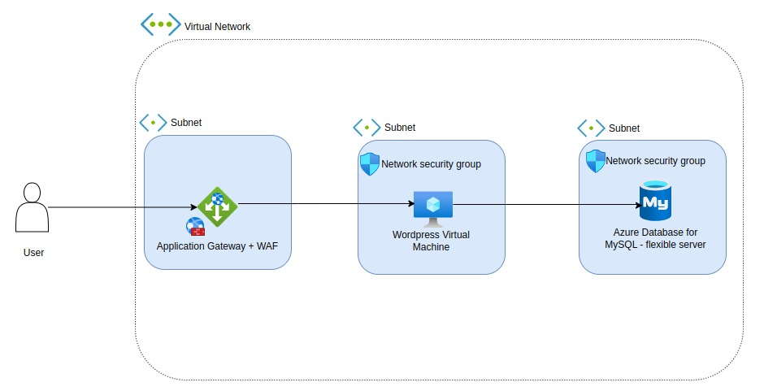
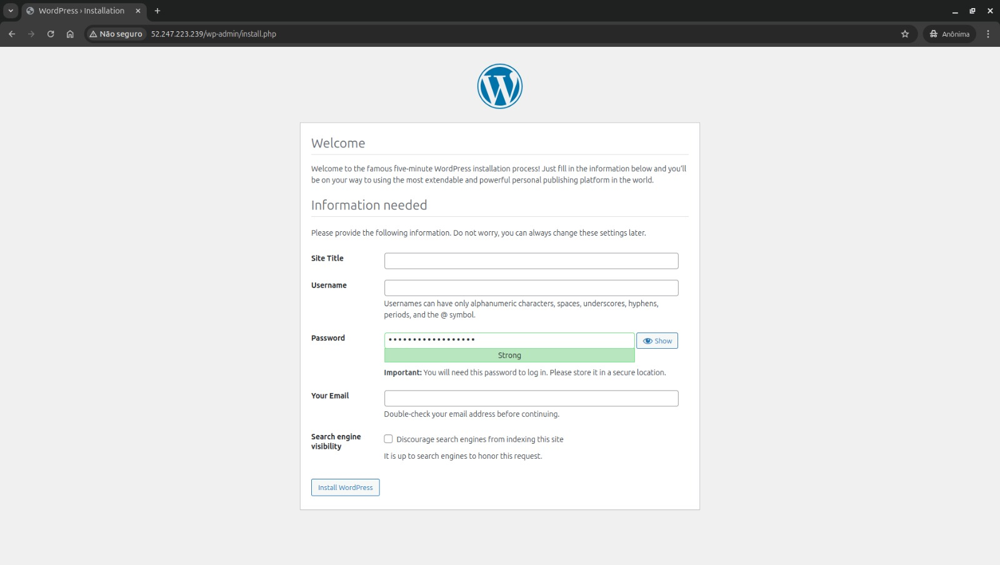

# Infraestrutura com Terraform: Hospedagem de Aplicação WordPress no Azure

Este projeto cria uma infraestrutura no Azure utilizando o Terraform para hospedar uma aplicação WordPress + PHP com Nginx.

O ambiente foi projetado para ser seguro e escalável, com um Application Gateway servindo como balanceador de carga e comunicação privada entre a aplicação e o banco de dados MySQL




## Características do Projeto

- Application Gateway com WAF (Firewall de Aplicação Web) para acesso seguro.
- Hospedagem do WordPress em uma Virtual Machine (VM).
- Banco de Dados Azure MySQL Flexible Server configurado com comunicação privada.
- Estrutura de sub-redes protegidas com NSGs (Grupos de Segurança de Rede).
- Infraestrutura modular e reutilizável.


## Pré-requisitos 
- Terraform instalado na sua máquina.
- Uma conta no Microsoft Azure.
- Permissões adequadas no Azure para criar recursos.

## Intruções de uso

1. Baixe ou clone este repositório e crie o arquivo de variáveis (.tfvars) na raiz do projeto para incluir informações específicas do seu ambiente.

2. No terminal, execute os seguintes comandos na ordem apresentada:


````
# Inicialize o Terraform
terraform init

# Formate o código
terraform fmt

# Planeje as alterações
terraform plan -var-file=<seuarquivo.tfvars>

# Aplique as alterações para criar os recursos no Azure
terraform apply -var-file=<seuarquivo.tfvars>
````
3. Após a criação dos recursos, conecte-se à VM para configurar o ambiente do WordPress:


````
# Conecte-se via SSH
ssh azureuser@<endereço-ip>

# Torne o script de configuração executável
chmod +x setup.sh

# Execute o script de configuração
sudo ./setup.sh
````
4. Abra o navegador e insira o endereço IP fornecido para começar a configurar o seu site WordPress:



## Arquitetura Detalhada
A infraestrutura é composta pelos seguintes componentes:

1. Application Gateway com WAF:

    - Protege o acesso à aplicação contra ataques comuns (como SQL Injection e XSS).
    - Realiza balanceamento de carga para garantir alta disponibilidade.

2. Virtual Machine (VM):

    - Hospeda a aplicação WordPress com Nginx e PHP.

3. Azure MySQL Flexible Server:

    - Banco de dados gerenciado com alta performance e segurança.

4. Redes Virtuais (VNET):

    - Configuradas com sub-redes isoladas e protegidas por NSGs.
